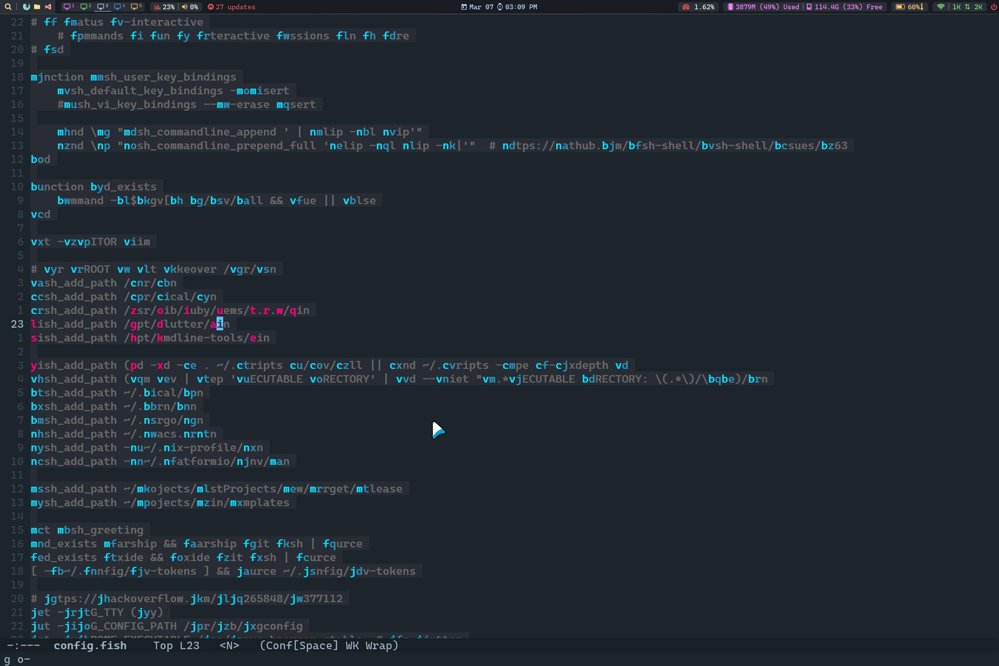

# hop.el

An easymotion-like plugin highly inspired from [hop.nvim](https://github.com/phaazon/hop.nvim).

```
Emacs Motion on Speed!
Move anywhere in your buffer with 1 or 2 keypress.
```



## Why?

While there has been past options for jumping over the buffers like [avy](https://github.com/abo-abo/avy) and [ace-jump-mode](https://github.com/winterTTr/ace-jump-mode), they both didn't fit me due to various reasons & limitations.

Hence, this package evolves.

### Features

1. **Single-Keypress Jumps for Targets Closer to the Cursor**.
2. **Convenient:** Using single-keypress hop/jump as much as possible by generating hop sequence at runtime with [TrieBackfilling Algorithm](https://phaazon.net/blog/hop-trie-backtrack-filling).
3. **Flexible:** Customizable alphabet splitting and jump location (start/middle/end of match).
4. **Clear Distinction of Jumps** based on required keypress (faces) and that can also be customized.
5. **Easy Modification** of Regex with **Full PCRE Support** for hop selection.
6. **Default Exclusion of Subword Matches** for simpler jump targets (matching words after hyphen is usually a distraction by having too many jump targets).
7. Last but not least, works across window splits.

I wouldn't say this is a feature, but in avy if you try to jump to `p` in `abc             p`, then you'll only see 1 char due to buffer overflow, once you press that you'll see futher part of sequence, but this implementation automatically addresses that using 'before-string as necessary as we reach `\n`.

## Installation

It requires [syohex/emacs-pcre](https://github.com/syohex/emacs-pcre), and pcre(-dev) package installed on your system at build time.

### Install pcre(-dev) package based on your system

```bash
sudo xbps-install -y pcre-devel
sudo pacman --no-confirm pcre
# ...
```

### Install the emacs package

If you're using elpaca/straight as package manager, write the following package declaration:

```lisp
(use-package pcre
  ;; :straight if you use stright.el
  :elpaca (pcre :host github :repo "syohex/emacs-pcre"
                  :pre-build ("make" "all")
                  :files (:default "pcre.el" "pcre-core.so")))
(use-package hop
  :elpaca (hop :host github :repo "Animeshz/hop.el"))
```


## Usage

The library exposes **5 interactive functions** that can be accessed via M-x:

* hop-word
* hop-char
* hop-line
* hop-line-skip-whitespace
* hop-regex-pattern

Each of the function matches & create hops/jumps for their respective targets in the viewable buffer.

Package also exposes a few **user-customizable variables**, see the top of [hop.el](hop.el).

